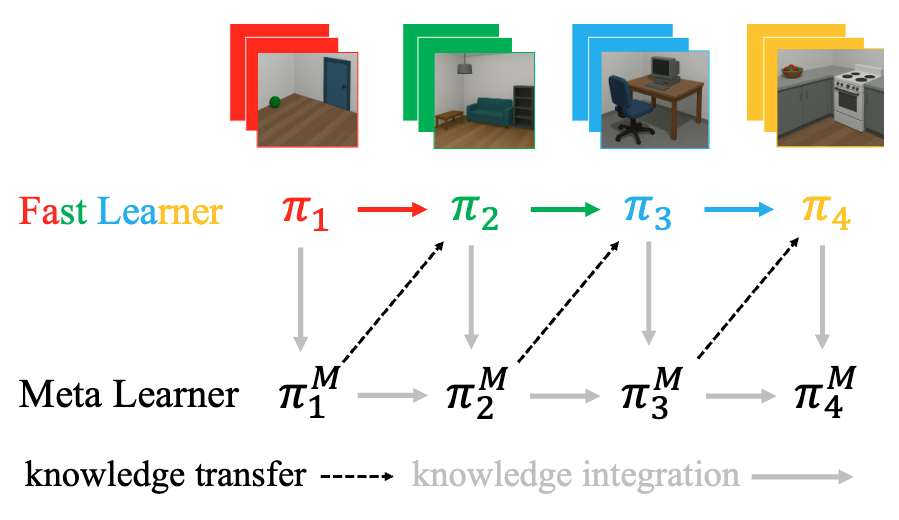

# Official Implementation of Principled Fast and Meta Knowledge Learners for Continual Reinforcement Learning (ICLR 2026)

This repository contains the Pytorch implementation of our FAME continual RL algorithm "[Principled Fast and Meta Knowledge Learners for Continual Reinforcement Learning](https://openreview.net/forum?id=loNTDX3wTn)". We employ our FAME algorithm in the environments of MinAtar, Atari, and MetaWorld, respectively.

<p align="center">
    
</p>


# Environment 1: MinAar

## Environmental Setup 

```bash
pip install -r MinAtar/requirements.txt # python=3.10
```


## baseline methods: 

For example, we can run the baseline algorithms on the sequence `3` of tasks.

```
# Reset
python DQN.py --lr1=1e-5 --seed=0 --save --save-model --seq 3 --reset 1 --gpu 0 
# Finetune
python DQN.py --lr1=1e-5 --seed=0 --save --save-model --seq 3 --reset 0 --gpu 0 
# Multi-head
python DQN_multi_task.py --lr1=1e-5 --seed=0 --save --save-model --seq 3 --gpu 0
# LargeBuffer
python DQN_large_buffer.py --lr1=1e-4 --seed=0 --save --save-model --seq 3 --gpu 0 
# PT-DQN
python PT_DQN_half.py --lr1=1e-8 --lr2=1e-4 --decay=0.75 --seed=0 --save --save-model --seq 3 --gpu 0 
```

## Our FAME approach

| Argument | Value | Description |
| :--- | :--- | :--- |
| `lr1` | `1e-3` | Learning rate for Fast Learner |
| `lr2`| `1e-5` | Learning rate for Meta Learner |
| `size_fast2meta` | `12000` | N： Number of samples collected in each fast learning to replay buffer (12000 × 7 = 84000 < 100000) |
| `size_meta` | `100000` | Size of meta replay buffer (same as original simple DQN setting) |
| `warmstep` | `50000` | L: Warm-up step with behevior cloning |
| `detection_step` | `1200` | n: number of steps for policy evaluation |
| `lambda_reg` | `1.0` | Regularization hyperparameter in behavior cloning |
| `use_ttest` | `0` | 0: empirical ranking, 1: t-test for one-vs-all hypothesis test |
---

```
python FAME.py --lr1=1e-3 --lr2=1e-5 --size_fast2meta 12000 --detection_step 600 --seed=1 --save --save-model --seq 1 --gpu 0 --warmstep 50000  --lambda_reg 1.0 
```

## bash

We can run the bash file, but we suggest to tailor the bash code with your compute resources.

```
bash run.sh
```


## Acknowledgement

This implementation in MinAtar is adapted from [the released code](https://github.com/NishanthVAnand/prediction-and-control-in-continual-reinforcement-learning/tree/main) of the paper [Prediction and Control in Continual Reinforcement Learning](https://arxiv.org/abs/2312.11669) (NeurIPS 2023).


# Environment 2: Atari Games


## Environmental Setup

```bash
pip install -r Atari/requirements.txt
```

## Baselines: 

| Argument | Value | Description |
| :--- | :--- | :--- |
| `--algorithm` | `from-scratch` | Reset|
| | `finetune` | Finetune |
| | `packnet` | Packnet |
| | `prog-net` | ProgressiveNet |
| `--env` | `ALE/SpaceInvaders-v5` | Sequence in Spaceinvader |
| | `ALE/Freeway-v5` | Sequence in Freeway |
---

```
# example: packnet
python run_experiments.py --algorithm packnet --env ALE/SpaceInvaders-v5 --seed 1 --start-mode 0
```


## Our FAME Approach

We use a set of default hyper-parameters without sweeping them, but it already suggests the superiority in the performance.

In the original code, we run `run_experiments.py` to conduct all baselines algorithms. A straightforward application of this implementation logic to FAME is not applicable as the meta buffer will require the huge memory resources. Therefore, we modify the implementation log and run the FAME algorithm via `run_ppo_FAME.py`.

```
python run_ppo_FAME.py --model-type=FAME --env-id=ALE/Freeway-v5 --seed=0 --save-dir=agents --total-timesteps=1000000 --epoch_meta 200
python run_ppo_FAME.py --model-type=FAME --env-id=ALE/SpaceInvaders-v5 --seed=0 --save-dir=agents --total-timesteps=1000000 --epoch_meta 200
```

## Evaluation

```
python process_results_pre.py # from event data to csv
python process_results.py # from csv to CRL-relavant metrics
```


## Acknowledgement

This implementation in Atari is adapted from [the released code](https://github.com/mikelma/componet) of the paper [Self-composing policies for scalable continual reinforcement learning](https://arxiv.org/abs/2506.14811) (ICML 2024). 


# Environment 3: MetaWorld

## Environmental Setup

```bash
pip install -r Metaworld/requirements.txt
```

**Note:** The requirements file includes `mujoco` and `metaworld`. Please ensure you have the necessary system dependencies for MuJoCo installed.


## 1. Running FAME & Standard Baselines

To run the main experiments using FAME and standard baselines (Reset, Average, Finetune), use the following command:

```bash
python test_main.py --seed 0 --method buffer --gpu 0 --store_traj_num 10 --use_ttest 1 --env metaworld_sequence_set18
```

### Arguments Reference

| Argument | Value | Description |
| :--- | :--- | :--- |
| `--method` | `buffer` | **FAME-KL** (Our method) |
| | `buffer_wd` | **FAME-MD** (Our method variant) |
| | `independent` | **Reset** (Baseline: Train from scratch) |
| | `average` | **Average** (Baseline: Parameter averaging) |
| | `continue` | **Finetune** (Baseline: Continual learning without regularization) |
| `--env` | `metaworld_sequence_set6` | Sequence of 6 tasks |
| | `metaworld_sequence_set12` | Sequence of 12 tasks |
| | `metaworld_sequence_set18` | Sequence of 18 tasks |
| | `metaworld_sequence_set22` | Sequence of CW10 |

---

## 2. Running Advanced Baselines (PackNet, ProgressiveNet, CompoNet)

These baselines are located in a separate directory.

### Prerequisites
**Important:** You must first run the `simple` algorithm (SAC) to generate the initial model for the first task, which is required by other baselines.

### Execution Steps

1. Navigate to the experiment directory:
   ```bash
   cd Metaworld/baselines_packnet_progressivenet_componet/experiments/meta-world
   ```

2. Run the experiment:
   ```bash
   python run_experiments.py --algorithm simple --seed 0 --start-mode 0 --task-sequence 6
   ```

### Arguments Reference

| Argument | Value | Description |
| :--- | :--- | :--- |
| `--algorithm` | `simple` | **SAC** (Standard Soft Actor-Critic) |
| | `packnet` | **PackNet** |
| | `prognet` | **ProgressiveNet** |
| | `componet` | **CompoNet** |


## Reference
Please cite our paper if you use our implementation in your research:
```

@inproceedings{
sun2026principled,
title={Principled Fast and Meta Knowledge Learners for Continual Reinforcement Learning},
author={Ke Sun and Hongming Zhang and Jun Jin and Chao Gao and Xi Chen and Wulong Liu and Linglong Kong},
booktitle={The Fourteenth International Conference on Learning Representations},
year={2026},
url={https://openreview.net/forum?id=loNTDX3wTn}
}
```
